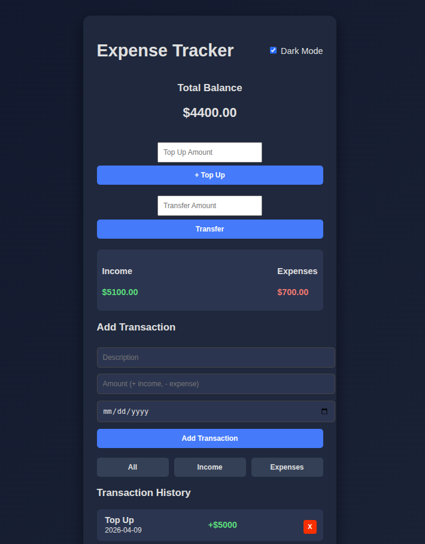

# EXPENSE TRACKER

## :beginner: Overview
This is an expense tracker app that permits an individual to add, view and delete income and expenses. It also calculates and display their balances as they perform transactions.

### :file_folder: Project Structure

```text
|
|--- .github/
| |--- workflows/
|    |--- linters.yml # Contains the linters code for checking code errors
|
|--- index.html # The main HTML file containing the page structure
|
|--- script.js # contains the JavaScript implementation of the app
|
|--- style.css # All CSS styling
|
|---README.md # Project overview and documentation
|
```

### :star: Tech Stack
- HTML
- CSS
- JavaScript


### :sparkles: Features
- Add tranactions
- Transaction history
- Display totals
  - Total balance
  - Total income
  - Total expenses
- Add transaction data


### :electric_plug: How to run this project
1) Clone the repository [here](git@github.com:AsohLove/Expense-Tracker-App.git)
2) Open index.html in a browser


### App Preview


* :rocket: [Deployed page](https://asohlove.github.io/Expense-Tracker-App/)


:technologist: **Love Asoh**

- GitHub: [@loveasoh](https://github.com/AsohLove)
- Twitter: [@loveasoh](https://x.com/LoveTheModifier)
- LinkedIn: [@love asoh](https://www.linkedin.com/in/asohlove/)

## :lock: License
This project is [MIT](./LICENSE) licensed.